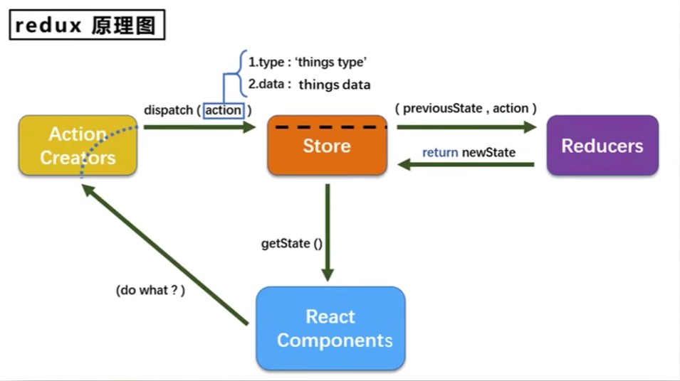
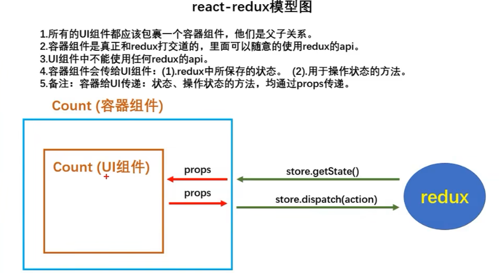

# Redux

## 作用
集中式管理react、vue、angular等应用中多个组件的状态，是一个库，不单单可用于react，只是更多的用于react中

## 模型图


## 三个核心
### action
1. 作用：action是把数据从应用传到store的有效载荷，是store数据的唯一来源
2. 创建
```javascript
import { INCREMENT, DECREMENT } from './constant'

export const incrementAction = (data) => {
  return { type: INCREMENT, data }
}

export const decrementAction = (data) => {
  return { type: DECREMENT, data }
}
```
3. 页面上的使用：通过分发action操作数据
```javascript
import { incrementAction, decrementAction } from './redux/actions'

export default class index extends Component {
  increment = () => {
    const { value } = this.selectNumber
    store.dispatch(incrementAction(value))
  }
}
```
4. 异步action：同步action中返回值为对象，而异步action中返回值为函数，其中一般会调用同步action
```javascript
export const incrementAsyncAction = (data, delay) => {
  return (dispatch) => {
    setTimeout(() => {
      dispatch(incrementAction(data))
    }, delay)
  }
}
```

### reducer
1. 作用：reducer指定了应用状态的变化如何响应action并发送到store中
2. 特征：本质是一个纯函数，接收两个参数，之前的状态(preState)、动作对象(action)。第一次被调用时，preState为undefined
3. 创建
```javascript
import { ADD_PERSON } from '../constant'

export default function personReducer(preState, action) {
  if (preState === undefined) {
    preState = [{
      id: '001',
      name: 'Tom',
      age: 23
    }]
  }

  // 从action中取出type和data
  const { type, data } = action

  switch (type) {
    case ADD_PERSON:
      // 没有对preState进行push或unshift操作，因为redux默认若返回值和之前状态一致，则不更新页面
      return [data, ...preState]
    default:
      return preState
  }
}
```
4. 纯函数
只要是同样的输入，必定得到同样的输出。遵循以下约束
  * 不得改写参数
  * 不能调用I/O的API
  * 不能调用Date.new()或者Math.random()等不纯的方法，因为每次会得到不一样的结果

### store
1. 作用：将action和reducer联系在一起，维持应用中的状态
2. 特征：一个应用只有一个store。当需要拆分数据处理逻辑时，应该使用多个reducer
3. 创建
   ```javascript
   import { legacy_createStore } from 'redux'
   import countReducer from './reducer'

   export default legacy_createStore(countReducer)
   ```
   当使用异步action后，需对store进行修改，使用redux-thunk和中间件支持异步action，修改后的store文件如下：
   ```javascript
   import { legacy_createStore, applyMiddleware } from 'redux'
   // 用于支持异步action
   import thunk from 'redux-thunk'
   import countReducer from './reducer'

   export default legacy_createStore(countReducer, applyMiddleware(thunk))
   ```
4. 页面上取值：
```javascript
render() {
 return (
   <div>
     <h1>当前求和为{store.getState()}</h1>&nbsp;
   </div>
 )
}
```

***

# react-redux

## 定义
react-redux其实是Redux的官方React绑定库，其中封装了一些Redux与React连接的操作，可以是Redux的使用更加简单

## 模型图


## 规则
1. 所有的UI组件被一个容器组件包裹，它们是父子关系
2. UI组件不与Redux进行操作，而是由容器组件与Redux进行操作，可以使用Redux的任意api
3. 容器组件会传给UI组件如下数据：
   1. 状态，即mapStateToProps()
   2. 操作状态的方法，即mapDispatchToProps()

## 基础使用（见04-react-redux基础使用）
### 建立容器组件时的注意点
1. 容器组件与UI组件通过react-redux中的connect进行连接，传递mapStateToProps和mapDispatchToProps
2. mapStateToProps()
   1. 用于传递状态
   2. 返回一个对象
   3. react-redux在调用该函数时已经传入了state
   4. 此处的值传入UI组件中，UI组件可使用this.props.xxx拿到对应的值
   5. 用到的store在根目录中通过Provider包裹App组件并传入store的方式获取
      ```javascript
      const root = ReactDOM.createRoot(document.getElementById('root'))
      root.render(
        <React.StrictMode>
          <Provider store={store}>
            <App />
          </Provider>
        </React.StrictMode>
      )
      ```
3. mapDispatchToProps()
   1. 用于传递操作状态的方法
   2. 返回一个对象，对象的key自定义，value是一个方法
   3. 注意简写方式

### 建立UI组件时的注意点
1. 不直接参与Redux的使用
2. 使用this.props.xxx拿到容器组件传来对应的值

## 融合UI组件与容器组件
开发时将UI组件与容器组件进行融合后放到一个文件中（见，05-融合UI组件与容器组件）

## 多个组件间的数据共享（重要，见06-react-redux数据共享）
1. 完善各个组件的action和reducer
2. 合并reducer，如下
```javascript
import { combineReducers } from 'redux'
import countReducer from './reducers/count'
import personReducer from './reducers/person'

/**
 * 合并Reducer
 * 使用combineReducers合并Reducer，key为自定义，value为reducer
 */
export default allReducer = combineReducers({
  count: countReducer,
  persons: personReducer
})
```
  注意：合并reducer后导致state变化，变为一个新的对象，对于组件mapStateToProps中对应的state需要通过`.属性`的方式取到
3. 修改store，使用合并后的reducer
```javascript
import { legacy_createStore, applyMiddleware } from 'redux'
// 用于支持异步action
import thunk from 'redux-thunk'
// 合并后的reducer
import allReducer from './reducers/index'

export default legacy_createStore(allReducer, applyMiddleware(thunk))
```